# Manual de Uso — Sistema de Rastreamento Florestal

**Versão:** 1.0.0  
**URL de produção:** https://gestao-florestal-api.vercel.app  
**Última atualização:** junho/2026

---

## Sumário

1. [Introdução](#1-introdução)
2. [Acesso ao sistema](#2-acesso-ao-sistema)
3. [Perfis de usuário](#3-perfis-de-usuário)
4. [Menu principal](#4-menu-principal)
5. [Agendamento de transporte](#5-agendamento-de-transporte)
6. [Entrega de madeira (viagens)](#6-entrega-de-madeira-viagens)
7. [Portaria](#7-portaria)
8. [Fila / Pátio](#8-fila--pátio)
9. [Dashboard e relatórios](#9-dashboard-e-relatórios)
10. [Cadastros e configurações](#10-cadastros-e-configurações)
11. [Fluxo operacional completo](#11-fluxo-operacional-completo)
12. [Perguntas frequentes](#12-perguntas-frequentes)

---

## 1. Introdução

O **Sistema de Rastreamento Florestal** gerencia o ciclo completo de transporte de madeira: desde o agendamento na origem até a chegada na fábrica, passando por portaria, fila de pátio, pesagem e descarga.

O sistema foi projetado para uso em **celular e tablet** (operação em campo e portaria), mas também funciona em desktop.

### Módulos disponíveis

| Módulo | Função principal |
|--------|------------------|
| Agendamento | Programar transportes de madeira |
| Entrega de Madeira | Acompanhar viagens em andamento |
| Portaria | Check-in e liberação de veículos |
| Fila / Pátio | Ordem de espera na unidade |
| Dashboard | Visão operacional em tempo real |
| Relatórios | Indicadores e análises |
| Cadastros | Dados base (frota, fazendas, usuários…) |
| Configurações | Parâmetros do sistema |

---

## 2. Acesso ao sistema

### 2.1 Tela de login

Abra o endereço do sistema no navegador. A primeira tela é o login.

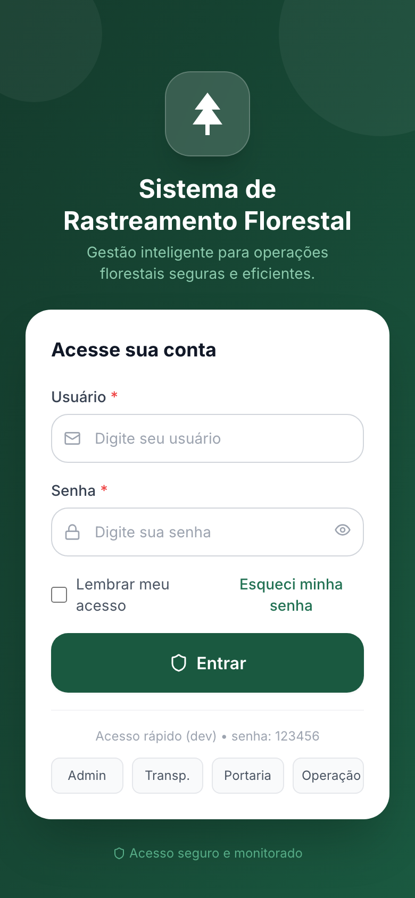

**Passo a passo:**

1. Informe seu **e-mail** (usuário).
2. Informe sua **senha**.
3. Opcionalmente marque **Lembrar meu acesso**.
4. Toque em **Entrar**.

> **Ambiente de demonstração:** a senha padrão dos usuários de teste é `123456`. Os botões de acesso rápido na parte inferior preenchem o e-mail automaticamente.

### 2.2 Usuários de teste

| Perfil | E-mail | O que enxerga |
|--------|--------|---------------|
| Administrador | `admin@florestal.com` | Todos os módulos |
| Transportador | `transportador@florestal.com` | Agendamento e viagens |
| Portaria | `portaria@florestal.com` | Portaria e fila |
| Operação | `operacao@florestal.com` | Fila, dashboard, relatórios |
| Gestor | `gestor@florestal.com` | Cadastros e relatórios |
| Motorista | `motorista@florestal.com` | Viagens (app motorista) |

---

## 3. Perfis de usuário

Cada perfil vê apenas os módulos relevantes para sua função. Isso evita confusão e protege dados sensíveis.

### Administrador — menu completo

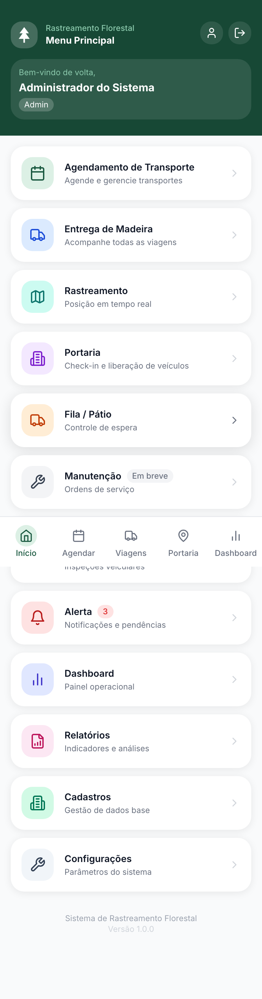

### Transportador — menu reduzido

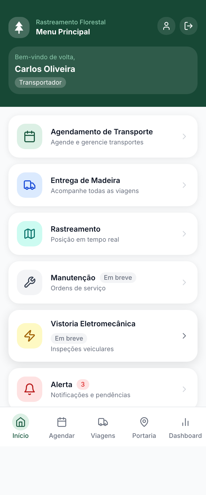

O transportador acessa **Agendamento** e **Entrega de Madeira**, mas não vê Portaria, Fila ou Configurações.

---

## 4. Menu principal

Após o login você chega ao **Menu Principal**, ponto de partida de todos os módulos.

**Elementos da tela:**

- **Cabeçalho verde** — nome do usuário e perfil (mobile).
- **Cards de módulos** — toque em qualquer card para entrar.
- **Badge "Em breve"** — módulos ainda não implementados (Manutenção, Vistoria).
- **Ícone de perfil** — acessa dados pessoais.
- **Sair** — encerra a sessão.

**Navegação:**

- Use o botão **← Voltar** no topo das telas internas para retornar ao menu.
- No desktop, a **barra lateral** permanece visível com atalhos.

---

## 5. Agendamento de transporte

> **Quem usa:** Transportador, Administrador

### 5.1 Calendário

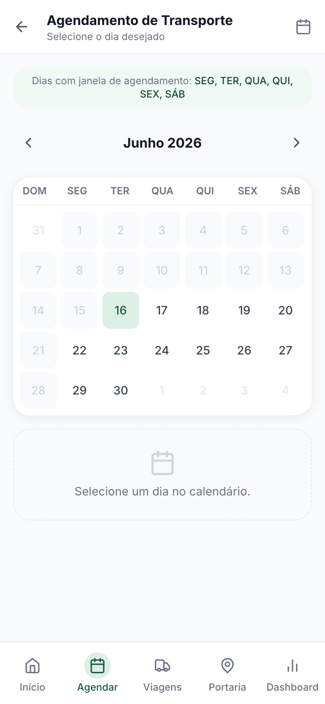

O calendário exibe os agendamentos por dia. Toque em um dia ou horário para criar ou visualizar transportes programados.

**Ações disponíveis:**

- Navegar entre meses.
- Ver agendamentos existentes (cor/indicador no dia).
- Iniciar **novo agendamento** a partir de um slot livre.

### 5.2 Novo agendamento

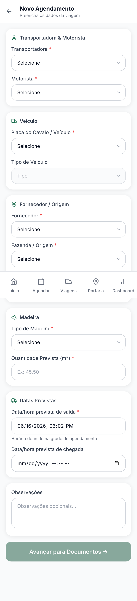

**Passo a passo:**

1. Menu → **Agendamento de Transporte** → Calendário → selecione data/hora **ou** acesse **Novo Agendamento**.
2. Preencha os campos obrigatórios:
   - **Transportadora**
   - **Motorista**
   - **Veículo** (placa)
   - **Fornecedor** e **Fazenda**
   - **Talhão**
   - **Tipo de madeira** e **volume previsto (m³)**
   - **Data/hora de saída** e **chegada prevista**
3. Adicione **observações** se necessário.
4. Confirme o agendamento.

> Os cadastros (transportadoras, motoristas, fazendas…) precisam existir previamente em **Cadastros**. Veja a [seção 10](#10-cadastros-e-configurações).

### 5.3 Etapas complementares do agendamento

O fluxo completo pode incluir telas adicionais acessíveis pelo menu de agendamento:

| Tela | Função |
|------|--------|
| Horários | Consultar janelas disponíveis |
| Documentos | Anexar NF, MDF-e, ordem de carregamento |
| Local de embarque | Definir ponto de carregamento |
| Resumo | Revisar antes de confirmar |

---

## 6. Entrega de madeira (viagens)

> **Quem usa:** Todos os perfis operacionais

### 6.1 Lista de viagens

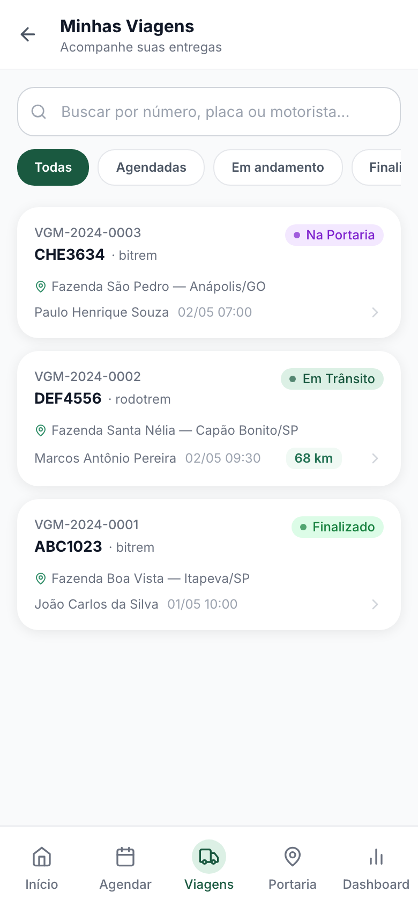

**Passo a passo:**

1. Menu → **Entrega de Madeira**.
2. Use a **barra de busca** para filtrar por número, placa ou motorista.
3. Use os **filtros de status** (Todos, Em trânsito, Portaria, etc.).
4. Toque em uma viagem para ver o detalhe.

Cada card mostra:

- Número da viagem (ex.: `VGM-2024-0002`)
- Placa e tipo do veículo
- Fazenda de origem
- Motorista e horário previsto de saída
- Badge de status colorido

### 6.2 Detalhe da viagem

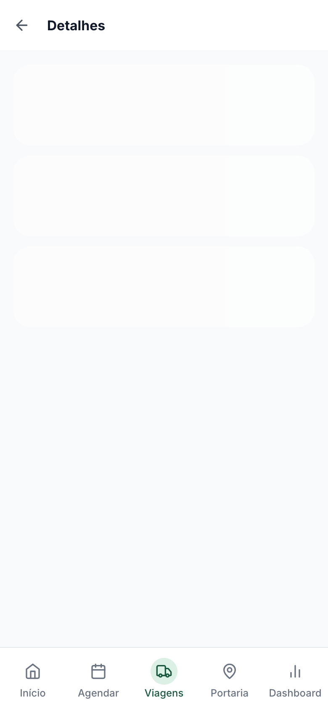

A tela de detalhe concentra todas as informações da viagem:

- **Linha do tempo** — progresso: Agendado → Carregado → Em trânsito → Portaria → Pesagem → Descarga → Finalizado
- **Dados do veículo e motorista**
- **Origem** (fornecedor, fazenda, talhão)
- **Documentos** e status de validação
- **Alertas** (desvio de rota, atraso…)
- **Atalhos:** Mapa, Alertas, Histórico

**Ações:**

- Toque em **Ver no mapa** para rastreamento em tempo real.
- Atualize o status quando autorizado (conforme perfil).

---

## 7. Portaria

> **Quem usa:** Portaria, Administrador

A portaria é o ponto de controle na chegada dos caminhões. Possui **duas abas**: Agendamentos e Check-in.

### 7.1 Visão geral

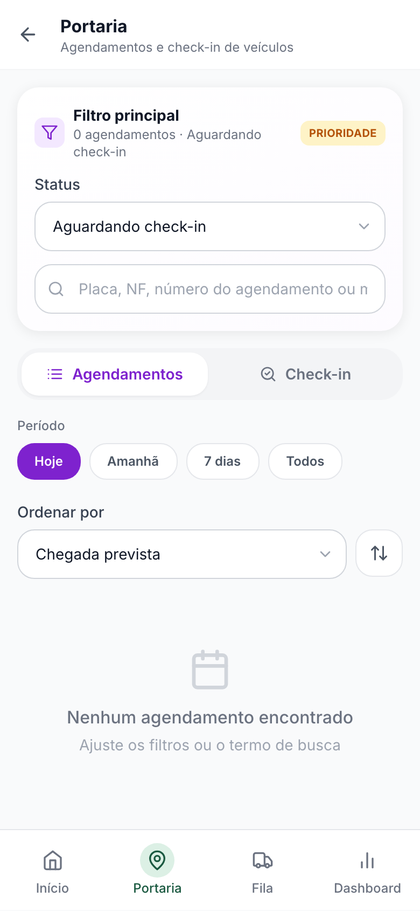

### 7.2 Filtro principal (topo da página)

No topo da tela de Portaria ficam os filtros que valem para **ambas as abas**:

| Campo | Descrição |
|-------|-----------|
| **Status** (dropdown) | Filtra agendamentos por situação. Padrão: **Aguardando check-in** |
| **Busca** | Placa, número da viagem ou agendamento |

**Opções de status:**

- Aguardando check-in *(padrão — prioridade)*
- Em trânsito
- Próx. fábrica
- Agendado
- Na portaria+
- Bloqueado
- Finalizado
- Sem viagem
- Todos

### 7.3 Aba Agendamentos

Lista os agendamentos conforme filtros aplicados.

**Filtros adicionais (dentro da aba):**

| Filtro | Opções |
|--------|--------|
| Período | Hoje · Amanhã · 7 dias · Todos |
| Ordenação | Chegada prevista · Saída · Placa · Número |
| Direção | Crescente / Decrescente (ícone ⇅) |

**Informações em cada card:**

- Placa, motorista, transportadora
- Fazenda, talhão, tipo de madeira, volume (m³)
- Horários de saída e chegada previstos
- Resumo de documentos (válidos / pendentes)
- Status da viagem vinculada

**Atalho para check-in:** toque no card → o sistema muda para a aba **Check-in** com a busca já preenchida.

### 7.4 Aba Check-in

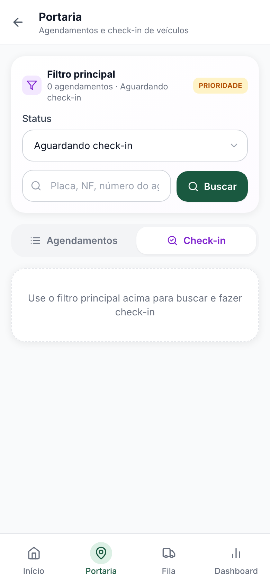

**Passo a passo do check-in:**

1. Na aba **Check-in**, digite a **placa**, **número da viagem** ou **agendamento** no campo de busca.
2. Toque em **Buscar** (ou selecione um agendamento na aba anterior).
3. Revise os dados exibidos:
   - Veículo, motorista, transportadora
   - Origem (fazenda, fornecedor)
   - Documentos (NF, MDF-e, OC…) com status
4. Escolha a ação:
   - **Liberar** — veículo entra na fila de pátio
   - **Bloquear** — informe o motivo (documento pendente, divergência…)

> Documentos com status **pendente** ou **inválido** aparecem destacados. Avalie antes de liberar.

---

## 8. Fila / Pátio

> **Quem usa:** Portaria, Operação, Administrador

Controla a ordem de espera dos veículos já liberados na portaria.

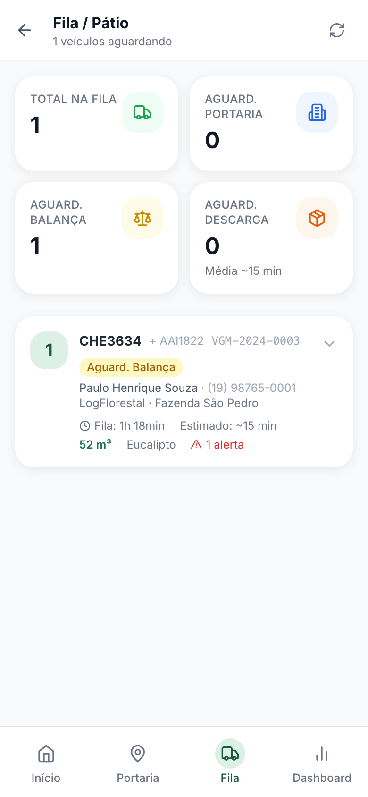

### 8.1 Indicadores (KPIs)

| KPI | Significado |
|-----|-------------|
| Total na fila | Veículos aguardando |
| Aguard. Portaria | Ainda no controle inicial |
| Aguard. Balança | Esperando pesagem |
| Aguard. Descarga | Esperando doca |

### 8.2 Lista de veículos

Cada card mostra:

- **Posição** na fila (número em destaque)
- Placa, carreta, número da viagem
- Motorista e telefone
- Transportadora e fazenda
- Tempo na fila e estimativa
- Volume (m³) e tipo de madeira
- Alertas de documentos pendentes

### 8.3 Expandir detalhes

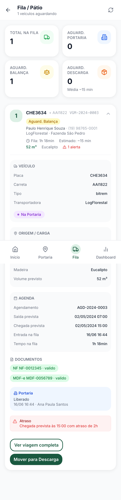

Toque no card para expandir e ver:

- **Veículo** — placa, carreta, tipo, transportadora
- **Origem / Carga** — fornecedor, fazenda, talhão, local de embarque, madeira, volume
- **Agenda** — horários previstos
- **Pesagens** — inicial e final (quando existirem)
- **Check-in** — último registro na portaria
- **Documentos** — situação de cada documento
- **Alertas** — pendências ativas

**Ações no card expandido:**

- Alterar **status da fila** (portaria → balança → descarga)
- **Ver viagem completa** — abre o detalhe da viagem

**Atualizar:** use o ícone ↻ no canto superior direito para recarregar a fila.

---

## 9. Dashboard e relatórios

### 9.1 Dashboard operacional

> **Quem usa:** Administrador, Operação

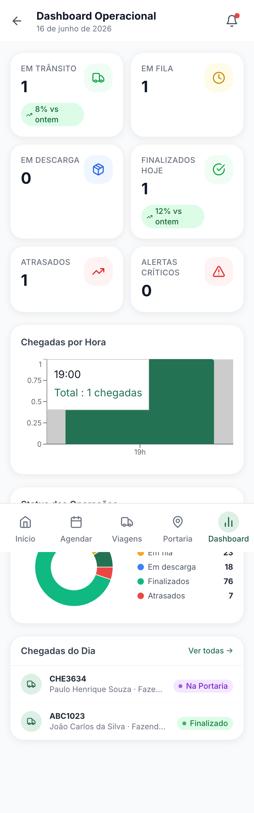

Painel com visão do dia:

- **KPIs:** em trânsito, em fila, em descarga, finalizados hoje, atrasados, alertas críticos
- **Gráfico de chegadas por hora** — distribuição ao longo do dia
- **Gráfico de status** — proporção por etapa
- **Lista de chegadas de hoje** — viagens recentes com status

Toque em uma viagem da lista para abrir o detalhe.

### 9.2 Relatórios

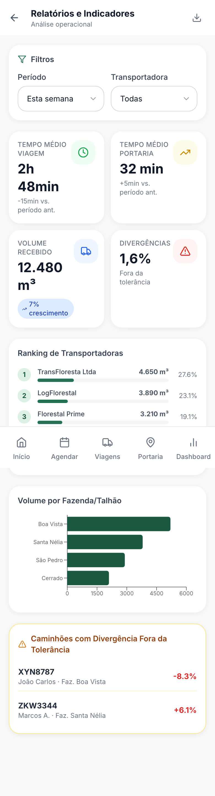

Módulo de indicadores e análises históricas. Disponível para perfis **Admin**, **Operação** e **Gestor**.

---

## 10. Cadastros e configurações

### 10.1 Cadastros

> **Quem usa:** Administrador, Gestor

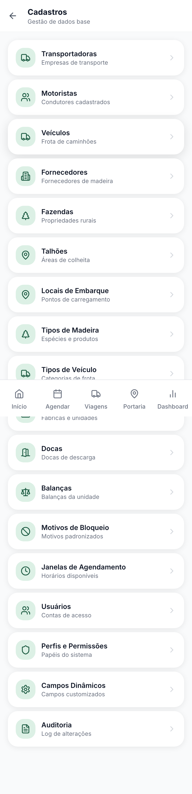

Central de dados base do sistema. Toque em qualquer item para listar, criar, editar ou excluir registros:

| Cadastro | Descrição |
|----------|-----------|
| Transportadoras | Empresas de transporte |
| Motoristas | Condutores |
| Veículos | Frota (placas, tipos) |
| Fornecedores | Fornecedores de madeira |
| Fazendas | Propriedades rurais |
| Talhões | Áreas de colheita |
| Locais de Embarque | Pontos de carregamento |
| Tipos de Madeira | Espécies/produtos |
| Tipos de Veículo | Bitrem, rodotrem… |
| Unidades | Fábricas |
| Docas | Pontos de descarga |
| Balanças | Equipamentos de pesagem |
| Motivos de Bloqueio | Lista padronizada |
| Janelas de Agendamento | Horários disponíveis |
| Usuários *(admin)* | Contas de acesso |
| Perfis e Permissões *(admin)* | Papéis do sistema |
| Campos Dinâmicos *(admin)* | Campos customizados |
| Auditoria *(admin)* | Log de alterações |

**Operação comum em qualquer cadastro:**

1. Toque no cadastro desejado.
2. Use **+ Novo** para criar registro.
3. Toque em um item da lista para **editar**.
4. Use o ícone de **lixeira** para excluir (quando permitido).

### 10.2 Configurações

> **Quem usa:** Administrador

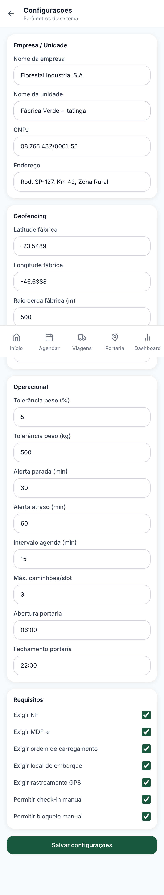

Parâmetros gerais: alertas por e-mail, regras operacionais, integrações e preferências do sistema.

---

## 11. Fluxo operacional completo

Este é o caminho típico de uma carga de madeira, do início ao fim:

```
┌─────────────┐    ┌─────────────┐    ┌─────────────┐    ┌─────────────┐
│ Agendamento │ →  │  Em trânsito │ →  │  Portaria   │ →  │ Fila/Pátio  │
│ (transport.)│    │  (viagem)    │    │ (check-in)  │    │  (espera)   │
└─────────────┘    └─────────────┘    └─────────────┘    └─────────────┘
                                                                │
                    ┌─────────────┐    ┌─────────────┐          │
                    │  Finalizado │ ←  │   Descarga  │ ←  Pesagem
                    └─────────────┘    └─────────────┘
```

| Etapa | Quem executa | Onde no sistema |
|-------|--------------|-----------------|
| 1. Agendar transporte | Transportador | Agendamento → Calendário / Novo |
| 2. Acompanhar viagem | Transportador / Operação | Entrega de Madeira |
| 3. Check-in na chegada | Portaria | Portaria → Check-in |
| 4. Entrar na fila | Automático após liberação | Fila / Pátio |
| 5. Pesagem inicial | Operação | Fila → Pesagem (atalho) |
| 6. Descarga | Operação | Descarga |
| 7. Pesagem final | Operação | Pesagem final |
| 8. Finalizar | Automático / Operação | Detalhe da viagem |

---

## 12. Perguntas frequentes

### Não consigo ver um módulo no menu

Verifique seu **perfil**. Transportadores não veem Portaria; Portaria não vê Cadastros. Peça ao administrador para ajustar seu perfil em **Cadastros → Usuários**.

### A lista da Portaria está vazia

- Confirme o **filtro de status** (padrão: Aguardando check-in).
- Amplie o **período** para "7 dias" ou "Todos".
- Limpe o campo de **busca**.

### O check-in não encontra o veículo

- Verifique se a viagem foi criada a partir do agendamento.
- Tente buscar pela **placa** sem hífen, ou pelo **número da viagem** (VGM-…).

### A fila não atualiza

Toque no ícone **↻** (atualizar) no canto superior direito. A lista é atualizada automaticamente ao mudar status.

### Esqueci minha senha

Entre em contato com o administrador do sistema para redefinir a senha em **Cadastros → Usuários**.

### O sistema está lento na primeira carga

Em produção (Vercel + banco cloud), a **primeira requisição** após período de inatividade pode levar alguns segundos (cold start). Recarregues subsequentes são mais rápidos.

---

## Apêndice — Regenerar capturas de tela

As imagens deste manual estão em `docs/manual/screenshots/`. Para atualizá-las após mudanças visuais:

```bash
npm install -D playwright   # se ainda não instalado
npx playwright install chromium
node scripts/capture-manual-screenshots.mjs
```

Opcionalmente defina outra URL:

```bash
APP_URL=http://localhost:5173 node scripts/capture-manual-screenshots.mjs
```

---

*Manual gerado para o projeto Gestão Florestal. Dúvidas ou sugestões: abra uma issue no repositório do projeto.*
